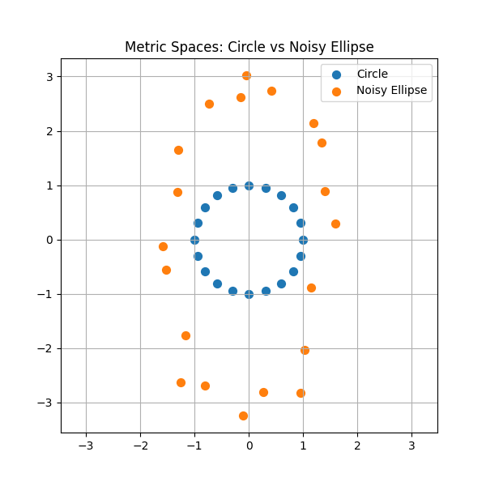
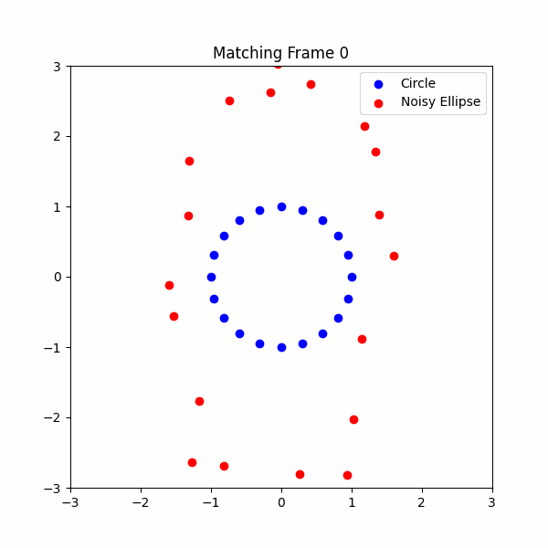
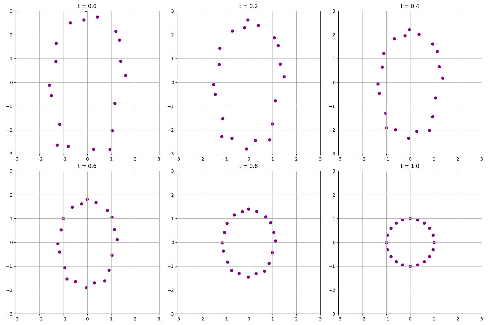
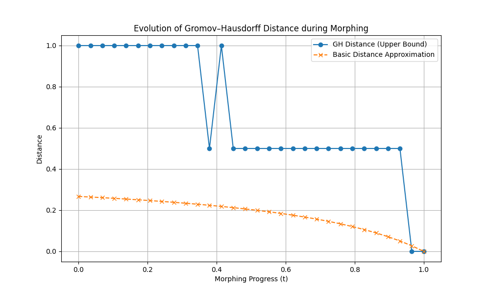

# Gromov–Hausdorff Distance Demo on Metric Spaces

**"Beyond Mere Token Analysis: A Hypergraph Metric Space Framework for Defending Against Socially Engineered LLM Attacks"**

In the course of exploring Gromov–Hausdorff distance, I was inspired by the paper:
["Beyond Mere Token Analysis" (Kaul, Saibewar, Babar, 2024)](https://papers.cool/venue/rnJxelIZrq@OpenReview).

This paper highlights how the geometry of input prompts in Large Language Models (LLMs) can be leveraged by defenders — by modeling prompts as metric spaces and using Gromov–Hausdorff distance to distinguish benign from malicious prompts generated through social engineering attacks. 

This project demonstrates how the **Gromov–Hausdorff distance** can be used to compare two simple metric spaces: a **perfect circle** and a **noisy, stretched ellipse**.

We explore:
- Computing the Gromov–Hausdorff distance between the two spaces.
- Visualizing internal distance structures.
- Animating morphing between shapes and tracking distance evolution.

---

## 📂 Project Structure

```

/images
metric_spaces.png         # Scatter plot of Circle vs Noisy Ellipse
distance_matrices.png     # Distance matrices comparison
matching.gif              # Animation of point matching
gh_evolution.png          # GH distance evolution during morphing
morphing_sequence.png     # Snapshots of morphing at various stages
main.py                       # Main Python script
requirements.txt              # Python libraries needed

````

---

## 🧪 How it Works

- **Step 1**: Generate two 2D point clouds:
  - Circle: points uniformly placed around a radius 1.
  - Noisy Ellipse: points around an ellipse with random noise added.

- **Step 2**: Compute internal **distance matrices** for both spaces.

- **Step 3**: Approximate Gromov–Hausdorff distance:
  - Normalize distance matrices.
  - Convert into adjacency matrices based on a distance threshold.
  - Use `persim`'s `gromov_hausdorff` function to compute lower and upper bounds.

- **Step 4**: Morph the ellipse into the circle progressively.
  - Track how the Gromov–Hausdorff distance decreases as the shapes align.

---

## 🖼️ Visualizations

### Metric Spaces


### Point Matching Animation


### Morphing Sequence


---

## 📈 Distance Evolution

We plot how the Gromov–Hausdorff distance evolves while morphing the noisy ellipse into the circle.  
It starts high and progressively drops toward zero as the structures become more similar.



---


## 📚 References

* [Gromov–Hausdorff Distance - Wikipedia](https://en.wikipedia.org/wiki/Gromov%E2%80%93Hausdorff_convergence)
* [`persim` Python Library Documentation](https://scikit-tda.org/projects/persim/en/latest/)


